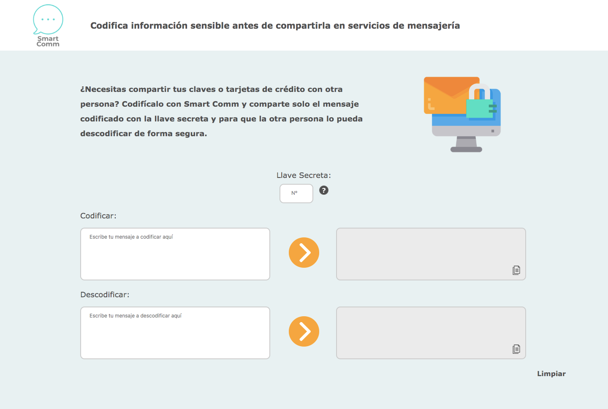

# Smart Comm

Smart Comm es una aplicación para codificar información sensible a hackeos antes de ser compartidas en servicio de mensajería mediante el [Cifrado César](https://en.wikipedia.org/wiki/Caesar_cipher).

## Usuarios

Los usuarios son todas aquellas personas que antes de enviar sus contraseñas o números de tarjeta de crédito por servicios de mensajerías, prefieren encriptarlas para evitar hackeos. 

Con Smart Comm se soluciona esa problemática, ya que el usuario puede enviar las contraseñas y o las tarjetas codificadas, con la llave secreta, para que la persona receptora pueda descodificarla de forma segura.

Es para todas las edades, pero en especial para la generación Millenial, que son los más preocupados de la seguridad de sus datos en la red.

  
## Proceso de diseño
  
* Para definir el diseño, se dibujó primero a papel, con dos "textarea" para los inputs para que fuese más claro para el usuario, si tenía la intención de codificar y descodificar:

* Luego se utilizó Figma para hacer el Wireframe, se decidió incluir la explicación de la app en primer plano para que fuese claro para el usuario la funcionabilidad de la app y se decidió por el nombre "Smart Comm":
  

* Se encontró una paleta de colores que fuera con el tema, con ayuda de [Coolors](https://coolors.co/) y con ayuda de la imagen encontrada en [Flaticon](https://www.flaticon.com/):

* Se hizo un diseño de logo en [freelogodesign](https://www.freelogodesign.org/):

* Por último se hizo el diseño final de en Photoshop:
	* Con background de color #E8F1F2 para que la lectura fuera amigable. 
	* Fuente Verdana 18px, ya que es una fuente fácil de leer y segura para todos los navegadores, y color #505050, ya que el negro no es aconsejado por que el contraste hace más difícil de leer. 

## Diseño Final

Luego de la prueba de UX, se tomó como mejora colocar un Tooltip donde dejara claro que había que colacar de Llave Secreta. 

Y se agregó íconos de Copiar para que fuera más amigable al usuario la usabilidad. 

## Archivos

#### index.html: 
Se encuentra toda la estructura del lenguaje de marcado de la aplicación y están enlazados el CSS y los dos Archivos JS.
#### style.css: 
Se encuentran los estilos de la página. 
#### cipher.js: 
Aquí se encuentran descritas las funciones de codificar y descodificar del Cifrado César.
#### index.js:
En este archivo se encuentra el JavaScript de los EventListener de los botones, que ejecutan las funciones de codificar y descodificar que se encuentran en cipher.js

## Instrucciones de uso

 1. Coloque la llave secreta (un número positivo o negativo) en la casilla de "Llave Secreta" con el que quiera codificar o descodificar.  
 2. Coloca tu mensaje en a codificar o descodificar en el campo correspondiente. 
 3. Cliquea en la flecha naranja para accionar la codificación o descodificación. 
 4. Puedes comenzar desde cero y borrar todos los campos al cliquear la palabra "Limpiar" en la parte de abajo a la derecha.
